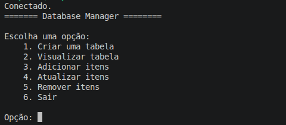
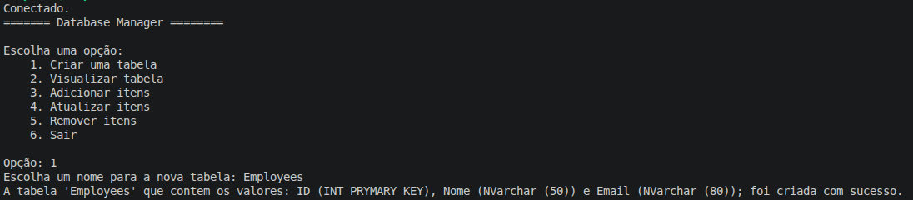
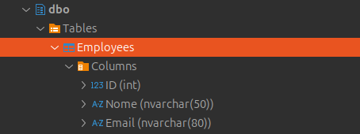
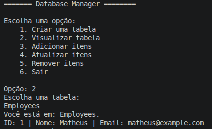
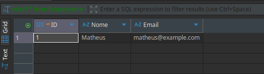
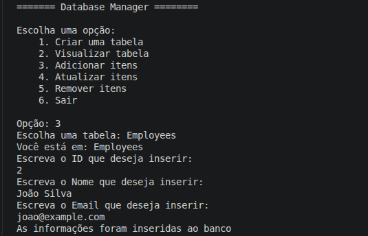
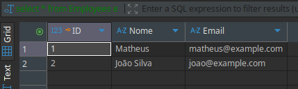
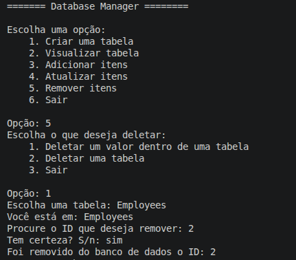

# Database Manager - Gerenciador de Banco de Dados SQL Server

Um aplicativo console em C# para gerenciar banco de dados SQL Server com operações CRUD completas. O projeto utiliza SQL Server rodando em Docker e pode ser validado através do DBeaver.

---

## Requisitos

- **Sistema Operacional**: Ubuntu/Linux
- **.NET**: 10.0.300
- **Docker**: Instalado e rodando
- **SQL Server**: Imagem Docker do SQL Server
- **DBeaver**: Para validar dados (opcional, mas recomendado)

---

## Configuração Inicial

### 1. Subir SQL Server no Docker

Se ainda não tem a imagem do SQL Server rodando, execute:

```bash
docker run -e "ACCEPT_EULA=Y" -e "SA_PASSWORD=ADMIN58454!" \
  -p 1433:1433 --name estudos-SQLSERVER \
  -d mcr.microsoft.com/mssql/server:latest
```

### 2. Verificar Conexão

A string de conexão já está configurada em [Connection.cs](Connection.cs):

```csharp
private static string connection = "Data Source = localhost; Database = master; User ID = sa; Password = ADMIN58454!; Encrypt = True; TrustServerCertificate = True";
```

Se precisar alterar o endereço, usuário ou senha, edite esse arquivo.

### 3. Compilar o Projeto

```bash
dotnet build
```

---

## Como Usar

### Executar a Aplicação



---

## Fluxo de Operações

### **Criar Tabela**

**O que faz**: Cria uma nova tabela com estrutura pré-definida

**Estrutura da tabela criada**:
- `ID` (INT PRIMARY KEY) - Identificador único
- `Nome` (NVARCHAR(50)) - Nome do registro (máx 50 caracteres)
- `Email` (NVARCHAR(80)) - Email do registro (máx 80 caracteres)

**Validação**: O nome da tabela não pode conter caracteres especiais, deve começar com letra ou underscore.

**Como usar**:
1. Selecione a opção `1`
2. Digite o nome da tabela (ex: `clientes`, `usuarios`, `produtos`)
3. A tabela será criada automaticamente





---

### **Visualizar Tabela**

**O que faz**: Exibe todos os registros de uma tabela específica no console

**Como usar**:
1. Selecione a opção `2`
2. Digite o nome da tabela que deseja visualizar
3. Todos os registros serão exibidos no formato: `ID: X | Nome: Y | Email: Z`





### 3️⃣ **Adicionar Itens**

**O que faz**: Insere um novo registro na tabela

**Validações**:
- A tabela deve existir
- O ID deve ser único (não pode repetir - violaria a PRIMARY KEY)
- ID deve ser um número inteiro válido
- Nome máximo de 50 caracteres
- Email máximo de 80 caracteres

**Tratamento de Erros**:
- **Erro 2627**: Chave primária duplicada (ID já existe)
- **Outros erros**: Mensagens gerais de erro SQL

**Como usar**:
1. Selecione a opção `3`
2. Digite o nome da tabela
3. Digite o ID (número inteiro)
4. Digite o Nome
5. Digite o Email
6. O registro será inserido automaticamente

**Exemplo de fluxo**:
```
Escolha uma tabela: Employees
Você está em: Employees
Escreva o ID que deseja inserir: 2
Escreva o Nome que deseja inserir: João Silva
Escreva o Email que deseja inserir: joao@example.com
Foram inseridos ao banco de dados.
```





---

### **Atualizar Itens**

**Validações**:
- A tabela deve existir
- O ID deve existir na tabela
- Se não encontrar o ID, exibe: "ID não encontrado. Nenhum valor foi atualizado."

**Como usar - Atualizar Nome**:
1. Selecione a opção `4` no menu principal
2. Digite o nome da tabela
3. Escolha a opção `1`
4. Digite o ID do registro
5. Digite o novo nome

**Como usar - Atualizar Email**:
1. Selecione a opção `4` no menu principal
2. Digite o nome da tabela
3. Escolha a opção `2`
4. Digite o ID do registro
5. Digite o novo email

**Como usar - Atualizar Ambos**:
1. Selecione a opção `4`
2. Digite o nome da tabela
3. Escolha a opção desejada (1=Nome, 2=Email, 3=Ambos)
4. Digite o ID e o novo valor

**Segurança**: Antes de deletar, o sistema pede confirmação (S/n ou sim/não)

**Como usar - Deletar Registro**:
1. Selecione a opção `5` no menu principal
2. Selecione a opção `1`
3. Digite o nome da tabela
4. Digite o ID do registro a ser removido
5. Confirme com `s`, `sim` ou `n`, `não`

**Exemplo**:
```
Escolha uma tabela: Employees
Você está em: Employees
Procure o ID que deseja remover: 2
Tem certeza? S/n: sim
Foi removido do banco de dados o ID: 2
```




**Como usar - Deletar Tabela**:
1. Selecione a opção `5` no menu principal
2. Selecione a opção `2`
3. Digite o nome da tabela
4. Confirme com `s` ou `sim`

**Exemplo**:
```
Escreva o nome da tabela: clientes
Tem certeza? S/n: Sim
Foi deletado do banco de dados a tabela: 'clientes'
```


---

## Validação com DBeaver

### Configurar Conexão no DBeaver

1. Abra o DBeaver
2. Clique em `New Database Connection` ou `Database` → `New Database Connection`
3. Selecione `SQL Server`
4. Configure com os seguintes dados:

```
Host: localhost
Port: 1433
Database: master
Username: sa
Password: ADMIN58454!
```

5. Clique em "Finish"


### Validar Dados Após Cada Operação

Após executar operações no seu aplicativo C#:

1. No DBeaver, vá até **Databases** → **master** → **Tables**
2. Clique com botão direito na tabela desejada
3. Selecione **Select Rows** ou **View Table Data**
4. Verifique se os dados correspondem aos exibidos no console

---

## Estrutura do Projeto

```
/home/suporte/estudos/
├── Program.cs              # Menu e fluxo principal
├── Connection.cs           # Classes de conexão e operações CRUD
├── testeBanco.csproj       # Configuração do projeto (.NET 10.0)
```

### Classes Principais (em [Connection.cs](Connection.cs))

| Classe | Método | Função |
|--------|--------|--------|
| `Connection` | `Connect()` | Testa ee selecione **Select Rows**
3. Verifique se os dados correspondem aos exibidos no console
| `Delete` | `DeleteOption(table, id)` | Deleta um registro pelo ID |
| `Delete` | `DeleteTable(table)` | Deleta a tabela inteira |
| `Visual` | `Visualization(table)` | Exibe todos os registros da tabela |
| `Menu` | `ShowMenu()` | Exibe menu principal |
| `Menu` | `ShowUpdateMenu()` | Exibe submenu de atualização |
| `Menu` | `ShowDeleteMenu()` | Exibe submenu de deleção |

---

## Erros Comuns e Soluções

| Erro | Causa | Solução |
|------|-------|--------|
| **"Erro ao tentar se conectar"** | SQL Server não está rodando | Execute: `docker ps` para verificar. Se não estiver, execute: `docker start estudos-SQLSERVER` |
| **"Essa tabela não existe"** | Nome digitado errado ou tabela não foi criada | Use opção 2 (Visualizar) com um nome de tabela conhecida ou crie uma nova |
| **"Este ID já existe"** | Tentou inserir um registro com ID duplicado | A PRIMARY KEY não permite duplicatas. Use outro ID |
| **"ID não encontrado"** | Tentou atualizar/deletar um ID inexistente | Verifique os IDs disponíveis com opção 2 (Visualizar) |
| **DBeaver não conecta** | Porta 1433 bloqueada ou credenciais erradas | Verifique: `docker port estudos-SQLSERVER` e confirme senhas |

---

## Exemplo Completo de Uso End-to-End

1. **Iniciar aplicação**
   - Console: "Conectado." + Menu principal
   
2. **Criar tabela "clientes"**
   - Console: prompt + mensagem de sucesso
   - DFluxo Típico de Uso

1. **Iniciar**: `dotnet run` → vê "Conectado." + menu
2. **Criar tabela**: Opção 1 → digita nome → confirmação
3. **Inserir dados**: Opção 3 → digita ID, Nome, Email
4. **Visualizar**: Opção 2 → lista registros
5. **Atualizar**: Opção 4 → escolhe campo e novo valor
6. **Deletar**: Opção 5 → confirma deleção
7. **Validar**: Verifique no DBeaver se os dados batem sempre pede confirmação)
- ✅ Nomes de tabela: `clientes` ✅, `_temp` ✅, `tabela1` ✅, `1tabela` ❌
- ✅ Use `dotnet watch` para desenvolvimento rápido com hot reload
- ✅ Antes de rodar, verifique: `docker ps` (SQL Server) e `dotnet --version`

---

## Possíveis Melhorias Futuras

- [ ] Buscar por Nome ou Email (não apenas por ID)
- [ ] Paginação para tabelas com muitos registros
- [ ] Validação de email com regex
- [ ] Exportar dados para CSV/Excel
- [ ] Sistema de logs de operações
- [ ] Interface gráfica (WinForms/WPF/Blazor)
- [ ] Autenticação de usuários
- [ ] Backup automático do banco

---

## Resumo das Tecnologias Utilizadas

| Tecnologia | Versão | Uso |
|------------|--------|-----|
| **.NET** | 10.0.300 | Runtime e compilação |
| **C#** | 12.0 | Linguagem de programação |
| **SQL Server** | Latest | Banco de dados |
| **Docker** | Latest | Containerização do SQL Server |
| **DBeaver** | Community | GUI para validação |
| **Ubuntu** | 24.04 | Sistema operacional |

---

## Suporte e Troubleshooting

**Problema**: Aplicação não inicia
1. Verifique se .NET 10 está instalado: `dotnet --version`
2. Compile novamente: `dotnet build`
3. Execute: `dotnet run`

**Problema**: Não consegue conectar ao SQL Server
1. Verifique se Docker está rodando: `docker ps`
2. Se container não estiver: `docker start estudos-SQLSERVER`
3. Teste a porta: `docker port sqlserver`
4. Tente conectar via DBeaver para diagnosticar

**Problema**: Operações ficam lentas
1. Verifique uso de CPU/memória do Docker: `docker stats`
2. Reinicie o container se necessário: `docker restart estudos-SQLSERVER`

---

**Desenvolvido em C# com .NET 10.0 | SQL Server | Docker | Ubuntu 24.04**

*Projeto educacional para aprender C#, SQL Server e Docker — Feito do zero, sem medo!*
